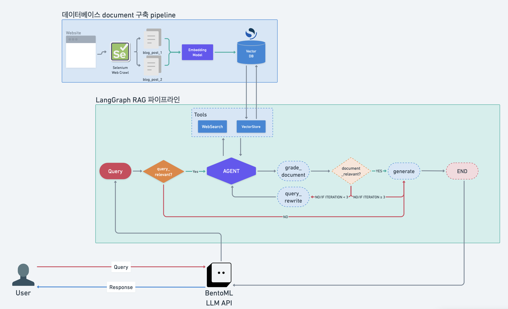

# 🦜 LLM Researcher

## 🥍 프로젝트 목표
- 데이터 사이언스 / 머신러닝 / 딥러닝 관련 질문들에 대해 답변해주거나 최신 기술들에 대해 리서치해 주는 LLM Agent 개발
- 문서 검색 도구를 LLM(RAG)과 결합하여 GPT나 HuggingFace Transformer같은 LLM 모델들의 환각 문제와 최신성 문제를 해결


## ⚙️ 기술스택

      

## 🦾 구현 기능
- OpenSearch VectorStore Database 구축
- Query와 관련있는 Document를 불러오기 위해 Semantic search와 Syntactic Search를 병합하는 Hybrid Search 구축
- Tool을 활용하는 Agentic RAG 구현
- LangGraph를 활용하여 Directed Graph RAG 파이프라인 구현
- LangGraph 파이프라인에 query의 주제 관련성을 파악하는 분기처릴르 추가해 사용자가 주제에서 벗어나지 않도록 유도

## 🚥 프로젝트 파이프라인

### 데이터베이스 구축 Pipeline
1. Selenium과 BeautifulSoup4를 활용하여 AI관련 주요 웹사이트에서 블로그 포스팅을 크롤링합니다
2. 크롤링된 글들을 embedding model로 임베딩을 하여 OpenSearch Vector Database
### Langchain RAG Pipeline
1. BentoML API로 User에게 query를 받습니다
2. BentoML API 내부의 LangGraph로 쿼리를 처리합니다
3. LangGraph의 그래프는 다음과 같은 노드들로 구성되어 있습니다
   | Node | 기능 |
    | --- | --- |
    | **query_relevant** | 사용자의 `query`가 주제와 연관이 있는지를 파악하여 분기처리를 합니다. `query`가 관련 있다면, `query`를 `Agent`로 전달하고, 관련이 없다면, 바로 `generate` 노드로 보냅니다.  |
    | **Agent** | `query`의 문맥을 파악하고, `Tool`들을 사용하여 인터넷이나 vector database에서 관련 `document`를 추출해 옵니다. |
    | **grade_document** | `Agent`가 `tool`을 사용해서 추출한 `document`가 `query`와 관련있는지 Yes/No로 점수를 책정합니다 |
    | **document_relevant** | `grade_document`에서의 판단에 따라 분기처리를 합니다. Yes로 판단하면, 추출된 `document`와 사용자의 `query`를 `generate` 노드로 보내고, No로 판단되면, `query`_rewrite로 유도합니다.|
    | **query_rewrite** | `document`를 다시 추출하기 위해 `query`를 비슷한 문맥으로 다시 작성합니다. |
    | **generate** | `document`가 `query`와 연관이 있다면, 최종 답변을 생성합니다. 만약 `query`가 관련이 없어 추출된 `documnet`가 없다면, `query`가 주제와 관련이 없다는 답변을 생성합니다.|
    | **END** | 답변을 생성하고, END노드에 도달하면, LangGraph의 파이프라인이 종료됩니다. |


## 🚧 Installation Guide

### 환경설정
1. [poetry document](https://python-poetry.org/docs/1.8/)를 참조하여`poetry==1.8.3`을 설치한 후, 프로젝트 메인 디렉토리에서 (`llm-mlops/`) poetry install로 환경설정을 합니다

### Opensearch 구성
1. OpenSearch admin 비밀번호를 구성합니다
   
```bash
export OPENSEARCH_INITIAL_ADMIN_PASSWORD={password}
```

2. 다음 command로 OpenSearch Vector database와 Opensearch Dashboard를 docker compose로 실행합니다
```bash
docker compose -f app/llm_server/vectorstore/docker-compose.yaml up -d
```

### Emedding Model 서버와 LLM service 세팅
1. OpenAI API활용을 위해 OPENAI_API_KEY를 설정합니다

```bash
export OPENAI_API_KEY={openai_api_key}
```

2. bash script로 embedding 서버와 LLM 앱 API docker image를 build합니다.

```bash
bash script/bento_build.sh
bash script/llm_server_container_build.sh
```
3. docker compose로 embedding 서버와 LLM 앱 API를 실행합니다

```bash
docker compose -f script/docker-compose.yaml up -d
```

4. `localhost:3000`을 접속해서 Swagger UI로 API를 테스트하거나 `curl`로  LLM API 앱이 잘 작동되는지 확인합니다.
```bash
curl -X 'POST' \
  'http://localhost:3000/generate' \
  -H 'accept: application/json' \
  -H 'Content-Type: application/json' \
  -d '{
  "params": {
    "prompt": "What is the latest LLM Model released by OpenAI?"
  }
}'
```

```bash
{
  "response": "The latest LLM model released by OpenAI is called o3, which was unveiled during their recent event. This model is the successor to the o1 model, which is designed for reasoning tasks. The context also mentions other models, such as the text-embedding-3-small, which provides significant improvements in embedding compared to its predecessor, text-embedding-ada-002. \n\nTo summarize, the most recent model is o3, which follows the earlier o1 model, and is a part of OpenAI's continuous updates to their language models to enhance performance and capabilities across various applications."
}
```


